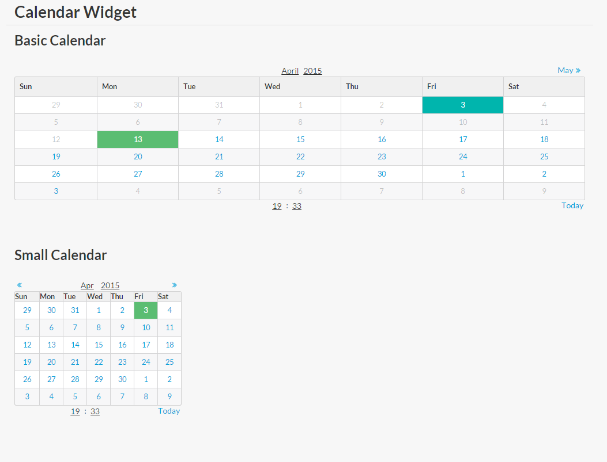

# sm-calendar
Mithril semantic-ui calendar widget

It requires mithril and semantic-ui-table and semantic-ui-grid

It is expected for mithril to be in global (m variable) or it will attempt to load it with `require('mithril')`, [webpack](http://webpack.github.io/docs/) its recommended



## Demo

[Demo](http://pinguxx.github.io/sm-calendar/)

```html
<!DOCTYPE html>
<html>

<head>
    <meta charset="utf-8">
    <meta http-equiv="X-UA-Compatible" content="IE=edge">
    <meta name="viewport" content="width=device-width, initial-scale=1">
    <link rel="stylesheet" href="https://cdnjs.cloudflare.com/ajax/libs/semantic-ui/1.10.3/semantic.min.css">
    <script src="bower_components/mithril/mithril.js"></script>
    <script src="Calendar.js"></script>
</head>

<body>

    <script src="test.js"></script>
</body>

</html>
```

```JavaScript
(function (m, Calendar) {
    var module = {};


    module.controller = function () {
        module.vm.init();
    };

    module.vm = {};
    module.vm.init = function (data) {
        this.customers = data;
        this.rowsperpage = 10;
        this.filter = m.prop('');
        this.calendar = new Calendar({
            mindate: new Date(new Date().getTime() + 10*24*60*60*1000),
            maxdate: new Date(new Date().getTime() + 30*24*60*60*1000 + 10000000)
        });
        this.calendar2 = new Calendar({small: true});
    };


    module.view = function (/*ctrl*/) {
        return m('', [
            m('.ui.grid.page', [
                m('br'),
                m('h1.ui.dividing.header', 'Calendar Widget')
            ]),
            m('.ui.grid.page', [
                m('h2', 'Basic Calendar'),
                module.vm.calendar.view(),
                m('button.ui..button.primary', {
                    onclick: function() {
                        console.log(module.vm.calendar.getDate());
                    }
                }, 'get')
            ]),
            m('.ui.grid.page.stackable', [
                m('h2', 'Small Calendar'),
                m('.row', [
                    m('.ui.column.five.wide', [
                        m('.ui.grid', [
                            module.vm.calendar2.view()
                        ])
                    ])
                ]),
                m('button.ui.button.primary', {
                    onclick: function() {
                        console.log(module.vm.calendar2.getDate());
                    }
                }, 'get')
            ])
        ]);
    };

    m.module(window.document.body, module);
}(m, Calendar));

```

## Attributes
It accepts the following properties, all of them are optional

 * mindate, min date that can be selected
 * maxdate, max date that can be selected
 * small, boolean, if you want to show a small calendar
 * value, date, current selected date
 * formatCell, function to format the cell, recieves a date object,
 * time, boolean, to display the time
 * onclick, function to react when the cell its clicked, doesnt work if formatcell its passed too
 * i18n, object map with:
    * **monthsLong**, array of string months in a long format `January, February` ...
    * **months**, array of string months in a small format `Jan, Feb` ...
    * **daysLong**, array of string days in a long format `Monday, Tuesday` ...
    * **days**, array of string days in a small format `Mon, Tue` ...
    

## Functions
Creating a calendar
```JavaScrit
var calendar = new Calendar({
    mindate: new Calendar();
});
```
Loading the view calendar
```JavaScrit
m('div', calendar.view())
```
You can jump to a date with
```JavaScrit
calendar.goToDate(date); //date must be a Date object
```
You can get the seleted date
```JavaScrit
calendar.getDate(); //returns Date object
```

